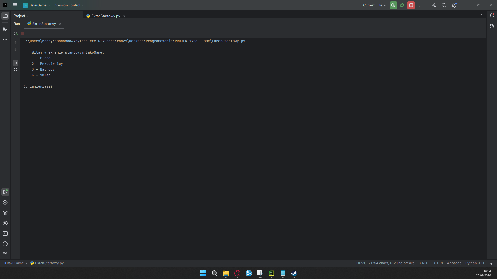
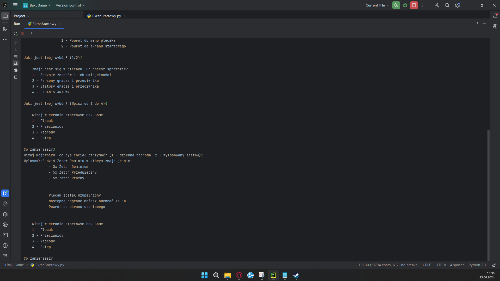
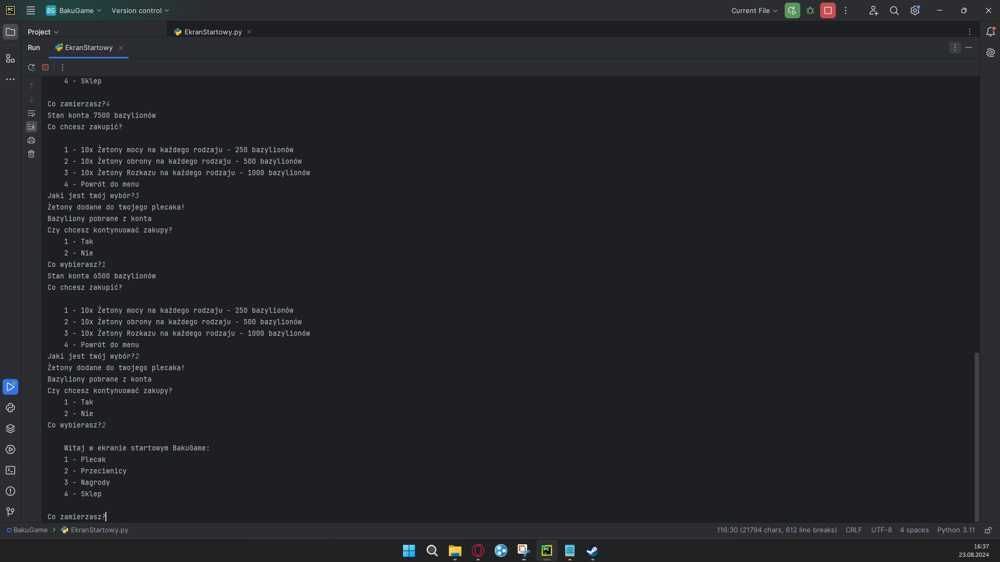
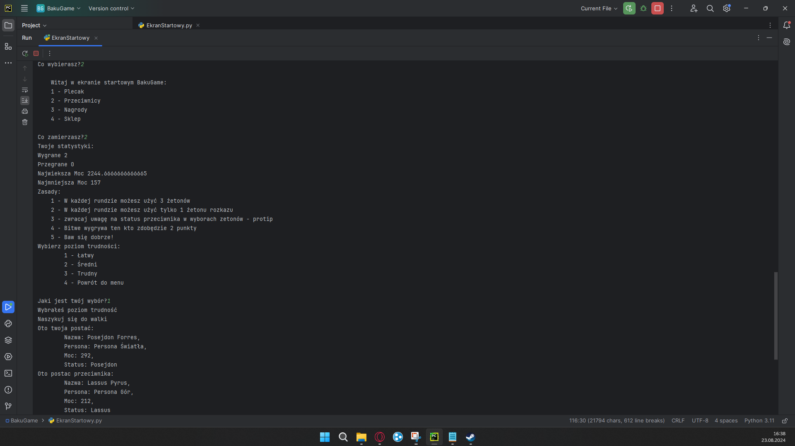
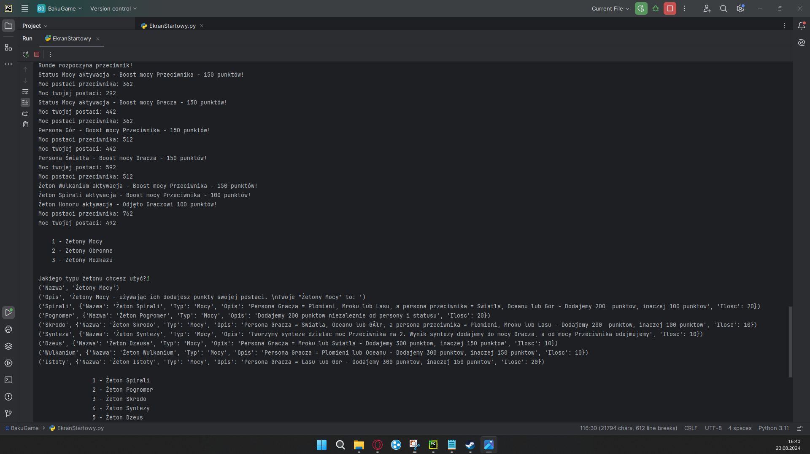
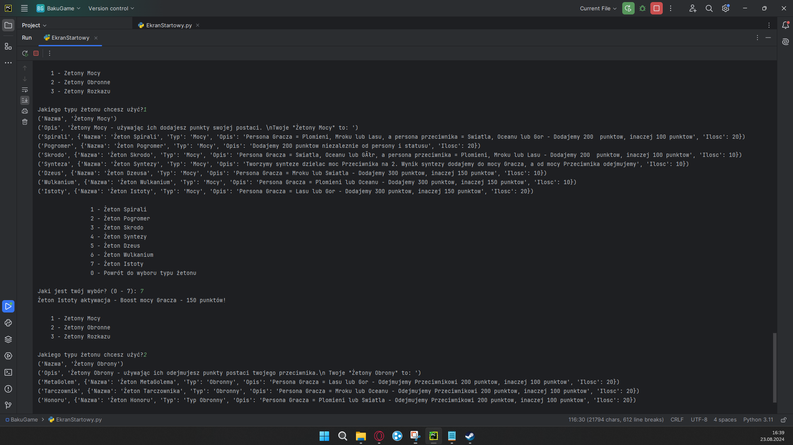
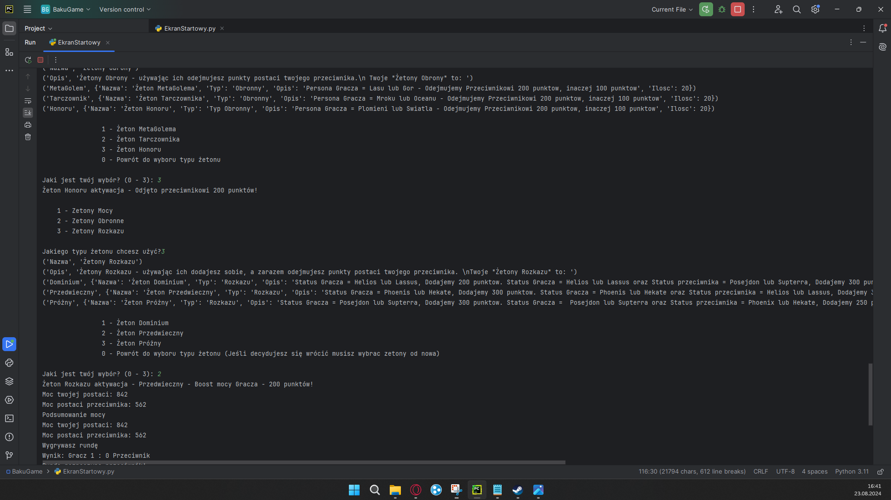
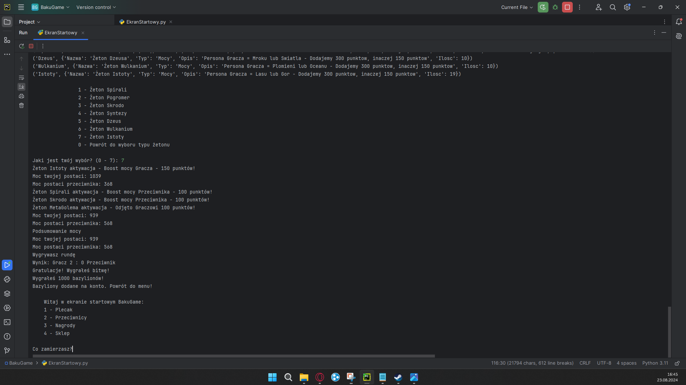

<h1>BakuGame</h1>

BakuGame to prosta gra stworzona w pythonie, w której zapisuje się postęp gracza. Projekt ten został stworzony w celu demonstracji możliwości tworzenia w Pythonie.

 
<h2>Funkcjonalności</h2>
<ul>
    <li>Plecak z żetonami</li>
    <li>Sklep z możliwością zakupu żetonów</li>
	<li>Walka z przeciwnikami</li>
</ul>

<h2>Technologie</h2>
<ul>
    <li>Python 3.x</li>
<li>Json</li>
</ul>

<h2>Poniżej znajdują się zdjęcia z wiidoku przykładowej rozgrywki</h2>

